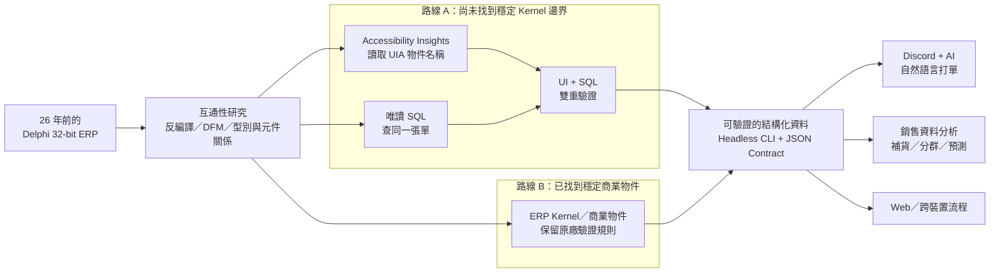
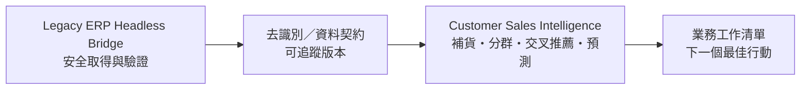

# 沒有 API、沒有文件、不能停機：我把 26 年前的 32-bit Delphi ERP 接上 AI

> 不是重寫 ERP，不是遠端桌面，也不是讓 AI 直接改資料庫。這個專案把一套 2000 年代的 Windows ERP，拆成可驗證的資料邊界，再接上 Headless CLI、Discord 自然語言工作流、Web 與銷售預測。

這份 Showcase 是我對群聯電子「[AI 賦能應用工程師](https://www.104.com.tw/job/8y9sm?jobsource=company_job)」職缺最直接的實作回答：面對沒有完整說明書的企業系統，透過試錯、拆解、驗證與持續優化，把 AI 真正接進既有流程，而不是只做一個離開真實環境就不能用的 Demo。這也呼應群聯所說的「[電玩高手思維](https://uanalyze.com.tw/articles/2374653827)」——先找到規則、突破限制，再把解法做成別人能穩定使用的系統。

## 起點：一套仍在營運的老 ERP

原系統是 32-bit Delphi Windows EXE。它承載多年商業規則，卻沒有現代 API，也不能直接在 macOS、手機或一般雲端環境執行。我的目標不是推倒重寫，而是先找出一條安全、可核對、可以逐步替換的路。

## 核心解法：從老 ERP 選一條可靠路徑

先針對合法持有、合法部署的程式做互通性所需的反編譯與 DFM／型別研究，目的不是複製原廠程式，而是找出「畫面、資料、商業規則」的責任邊界。接著依模組成熟度二選一，不必每次把兩條路全部重跑：

- **路線 A｜Accessibility + SQL 雙驗證**：還不確定內部物件時，先用 [Accessibility Insights for Windows](https://accessibilityinsights.io/) 的 Live Inspect 讀取 UI Automation 物件名稱，再以唯讀 SQL 查同一張單。兩邊一致，才把欄位關係納入自動化。Microsoft 目前也建議優先使用 Accessibility Insights；傳統 Inspect 則可用來深入檢視 UIA 屬性與控制模式。[官方說明](https://learn.microsoft.com/zh-tw/windows/apps/design/accessibility/accessibility-testing)
- **路線 B｜直接走 ERP Kernel**：如果已從反編譯、型別與元件關係中找到穩定的商業物件，就跳過座標、滑鼠與鍵盤，直接呼叫 ERP 既有規則，再以唯讀查詢做結果核對。

### 路線 A：畫面物件 + MSSQL，同一張單交叉確認

<table>
  <thead>
    <tr>
      <th width="50%">理解 UI 結構與物件</th>
      <th width="50%">唯讀 SQL 查到的實際資料</th>
    </tr>
  </thead>
  <tbody>
    <tr>
      <td></td>
      <td></td>
    </tr>
    <tr>
      <td>先理解欄位名稱、控制項層級與表單語意；畫面重建用來逐欄比對，不是截圖串流。</td>
      <td>再從單號追到客戶、品項、數量與價格，確認看到的不是「碰巧像」，而是同一筆持久化資料。</td>
    </tr>
  </tbody>
</table>

### 路線 B：拿掉 UI 事件，直接接上 ERP 商業物件

這張 Web 畫面不是 RDP、VNC、Canvas 截圖或 WebView 包裝。後端透過既有 ERP 邊界讀取資料，前端再用原生 HTML／CSS／JavaScript 重建資訊層級。畫面底部同時顯示 `SQL 唯讀`、`UI 未觸碰` 與 `ERP 鍵盤事件 0`，代表正式查詢不再依賴前景視窗。

## 為什麼不直接 INSERT／UPDATE SQL？

ELI5 版本：一張銷貨單不像一張便利貼，而像一份會同時影響帳務、庫存、稅額、發票、批號與稽核紀錄的多聯單。

直接寫 SQL 可能讓畫面「當下看起來正常」，卻漏掉其他關聯表、狀態欄位或原廠商業規則。問題不一定立刻爆炸，而是以庫存不平、稅額不一致、對帳失敗或重複單據的形式慢慢累積。因此本專案固定採用：

- SQL 只做探索、唯讀查詢與事後核對。
- 正式建立或修改單據，一律走 ERP Kernel／既有商業物件。
- 每次寫入操作都有固定欄位格式（schema）、明確確認、唯一請求識別與完成後獨立核對（reconciliation）。
- 結果不確定就停止，不盲目重送。

## 成功取得資料後：同一個核心，接不同入口

### 1. Discord + AI：把自然語言變成可驗證的銷貨單

AI 只負責理解「使用者想做什麼」；真正進 ERP 前，內容會被轉成固定 JSON 欄位、預覽並確認。打單仍由確定性的 CLI 與 ERP 商業規則完成，完成後再以 SQL 交叉核對。這讓 AI 有彈性，但不會取得直接寫資料庫的權力。

### 2. Web：把桌面入口拆成跨裝置工作流

同一個 Headless 核心也能支援遠端 Web 查詢、客戶模糊搜尋、歷史單據切換與作業整合。另一個已部署工作頁還串接郵局標籤、貨運、電子發票與 UDI 紀錄；外部服務只取得完成該次任務所需的最少資料。

  
<strong>展開：實際出貨與第三方作業頁</strong>

   
  

### 3. 分析與預測：資料不只拿來顯示，還能支持下一個決策

上游的 `legacy-erp-headless-bridge` 負責安全、唯讀、可驗證地取得 ERP 資料；下游的 [customer-sales-intelligence](https://github.com/joeIvan2/customer-sales-intelligence) 則把資料轉成業務可用的補貨提醒、客戶分群、交叉推薦、購買預測與工作清單。兩個 Repository 刻意分工：橋接層不偷偷做模型，分析層也不能越權操作 ERP。

## 這個專案如何對應 AI 賦能應用工程師

| 職缺要解的問題 | 這個專案已經做過的事 |
| --- | --- |
| AI 工作流整合 | 把 AI、Discord、Web、CLI、SQL Server 與 Windows ERP 串成端到端流程 |
| 客製化解決方案 | 不要求企業先換掉老系統，而是從實際限制找到可漸進導入的安全邊界 |
| API 與後端開發 | 以 Python、Flask、固定 JSON contract 與受控 Adapter 提供多端共用能力 |
| 商務分析與流程再造 | 將人工看表單、打單、核對、出貨與分析拆成可驗證、可稽核的步驟 |
| 推論成本與可靠性 | AI 只放在自然語言理解；核心查詢、寫入、驗證維持確定性，不浪費 Token 重做 ERP 規則 |
| 技術導入與支援 | 保留舊系統正常營運，逐步從 GUI PoC 升級到 Headless，不做一次性大爆改 |

## 技術與工程邊界

- Python / Flask / typed JSON contracts
- Microsoft SQL Server read-only analysis
- Windows UI Automation / Accessibility Insights
- Delphi DFM 與互通性研究
- Windows native interoperability / ERP business objects
- Discord application integration
- HTML / CSS / JavaScript Web UI
- pytest contract and regression testing
- 唯一請求識別、確認、reconciliation 與 fail-closed 操作政策

這個公開 Repository 只呈現原創架構、方法、成果畫面與安全設計；不包含原版 EXE、原廠 Library、反編譯原始碼、帳密、連線字串、可直接操作正式 ERP 的程式碼或資料庫寫入腳本。圖片由專案所有者提供並明確指定公開，使用規則見 [Screenshot Policy](docs/screenshots/README.md)。

更多設計細節： [Architecture](docs/ARCHITECTURE.md) · [Milestones](docs/MILESTONES.md) · [File Map](docs/FILE_MAP.md) · [Security](SECURITY.md)

---

**真正的 AI 落地，不是把 Chatbot 放在舊流程旁邊；是先看懂舊流程、找到安全邊界，再讓 AI 能可靠地完成工作。**
