# 沒有 API、沒有文件、不能停機：我把 26 年前的 32-bit Delphi ERP 接上 AI

[English version ↓](#english-version)

> 不是重寫 ERP，不是遠端桌面，也不是讓 AI 直接改資料庫。這個專案把一套 2000 年代的 Windows ERP，拆成可驗證的資料邊界，再接上 Headless CLI、Discord 自然語言工作流、Web 與銷售預測。

## 要解決的問題：ERP 像一座沒有門的倉庫

傳統 ERP 裡有客戶、訂單、庫存與帳務，也累積了多年商業規則；但它沒有現代 **API**，也沒有可供程式穩定呼叫的 **CLI**。資料雖然在裡面，外部系統卻沒有一扇安全、可驗證的門。

**AI 與組織效率提升之間，最大的隔閡——是沒有 API、只能靠人操作的 Legacy ERP。**

因此，每接一個新需求都會變成一次高風險客製：

- 電子發票：如何取得正確品項、稅別與金額，又能留下處理紀錄？
- 第三方支付：如何建立付款、接收 Webhook，並和 ERP 單據安全對帳？
- 第三方貨運：如何送出最少必要資料、取得標籤與貨態，卻不外洩 ERP 帳密？
- 業務異地打單：如何讓手機、macOS 或 Discord 下單，而不是遠端控制公司那台 Windows？
- 銷售預測：如何把歷史交易變成補貨、回購與交叉推薦訊號，而不是人工匯出 Excel？
- Lead 追蹤與預測：如何把客戶互動、下一步行動與結果回寫，形成可以持續改善的閉環？

本專案要做的，就是在不破壞老 ERP 的前提下補上這扇門：把內部能力整理成 **Headless CLI + JSON Contract**，讓發票、支付、貨運、遠端打單與 AI 分析都能接上同一個可驗證核心。

[開啟 8 頁全螢幕 Pitch](https://joeivan2.github.io/legacy-erp-headless-bridge/) · [查看 GitHub Repository](https://github.com/joeIvan2/legacy-erp-headless-bridge)

### 這些不是 Roadmap，而是同一套已運作系統

上圖是實際系統的模組導覽：銷貨與借還查詢、應收帳款、發票／貨運標籤、產品銷售分析、庫存盤點、人體組織入庫、大額方案簽核、折價券與臨床教育知識庫都已在同一套工作流運作。包含第三方支付／收款對帳在內，這些是**已完成能力**；後續可擴充的是新的支付或物流供應商 Adapter，不是從零開始。

這份 Showcase 是我對群聯電子「[AI 賦能應用工程師](https://www.104.com.tw/job/8y9sm?jobsource=company_job)」職缺最直接的實作回答：面對沒有完整說明書的企業系統，透過試錯、拆解、驗證與持續優化，把 AI 真正接進既有流程，而不是只做一個離開真實環境就不能用的 Demo。這也呼應群聯所說的「[電玩高手思維](https://uanalyze.com.tw/articles/2374653827)」——先找到規則、突破限制，再把解法做成別人能穩定使用的系統。

## 起點：一套仍在營運的老 ERP

<a href="docs/screenshots/legacy-delphi-sale-voucher.png">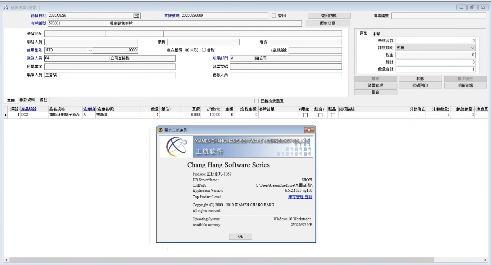</a>

原系統是 32-bit Delphi Windows EXE。它承載多年商業規則，卻沒有現代 API，也不能直接在 macOS、手機或一般雲端環境執行。我的目標不是推倒重寫，而是先找出一條安全、可核對、可以逐步替換的路。

## 核心解法：從老 ERP 選一條可靠路徑

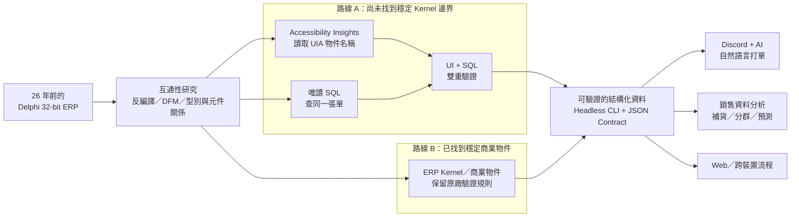

先針對合法持有、合法部署的程式做互通性所需的反編譯與 DFM／型別研究，目的不是複製原廠程式，而是找出「畫面、資料、商業規則」的責任邊界。接著依模組成熟度二選一，不必每次把兩條路全部重跑：

- **路線 A｜Accessibility + SQL 雙驗證**：還不確定內部物件時，先用 [Accessibility Insights for Windows](https://accessibilityinsights.io/) 的 Live Inspect 讀取 UI Automation 物件名稱，再以唯讀 SQL 查同一張單。兩邊一致，才把欄位關係納入自動化。Microsoft 目前也建議優先使用 Accessibility Insights；傳統 Inspect 則可用來深入檢視 UIA 屬性與控制模式。[官方說明](https://learn.microsoft.com/zh-tw/windows/apps/design/accessibility/accessibility-testing)
- **路線 B｜直接走 ERP Kernel**：如果已從反編譯、型別與元件關係中找到穩定的商業物件，就跳過座標、滑鼠與鍵盤，直接呼叫 ERP 既有規則，再以唯讀查詢做結果核對。

### 路線 A：畫面物件 + MSSQL，同一張單交叉確認

<table>
  <thead>
    <tr>
      <th width="50%">理解 UI 結構與物件</th>
      <th width="50%">唯讀 SQL 查到的實際資料</th>
    </tr>
  </thead>
  <tbody>
    <tr>
      <td><a href="docs/screenshots/web-rebuild-devtools.png">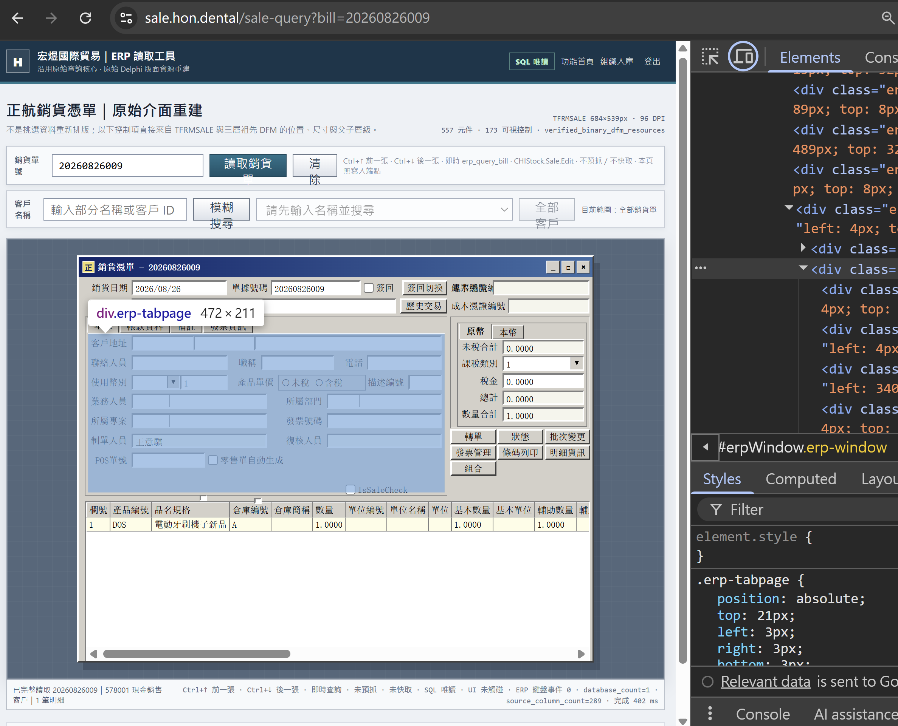</a></td>
      <td><a href="docs/screenshots/readonly-sql-sale-voucher.png">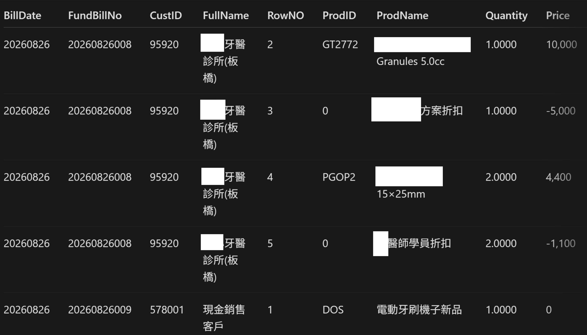</a></td>
    </tr>
    <tr>
      <td>先理解欄位名稱、控制項層級與表單語意；畫面重建用來逐欄比對，不是截圖串流。</td>
      <td>再從單號追到客戶、品項、數量與價格，確認看到的不是「碰巧像」，而是同一筆持久化資料。</td>
    </tr>
  </tbody>
</table>

### 路線 B：拿掉 UI 事件，直接接上 ERP 商業物件

<a href="docs/screenshots/web-sale-voucher.png">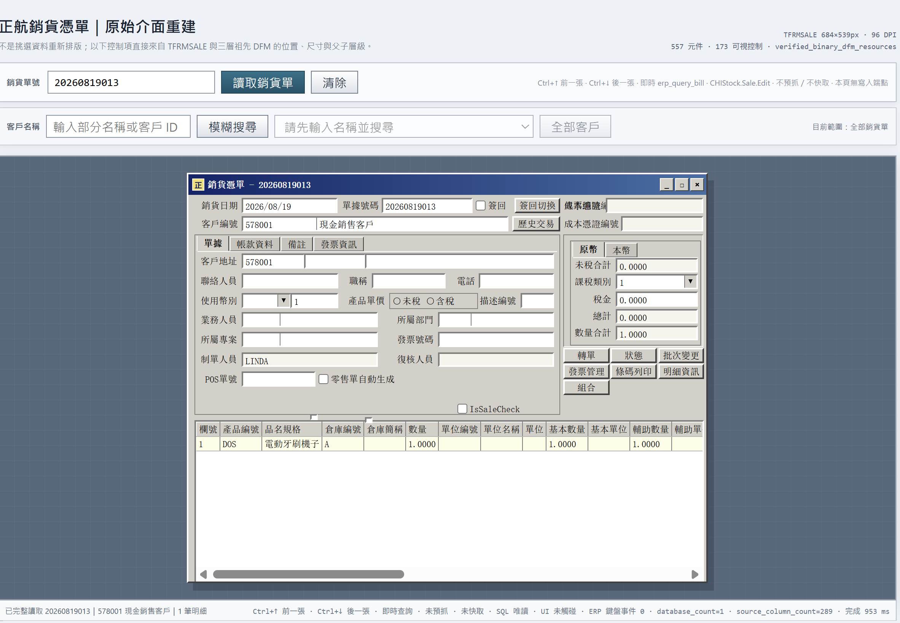</a>

這張 Web 畫面不是 RDP、VNC、Canvas 截圖或 WebView 包裝。後端透過既有 ERP 邊界讀取資料，前端再用原生 HTML／CSS／JavaScript 重建資訊層級。畫面底部同時顯示 `SQL 唯讀`、`UI 未觸碰` 與 `ERP 鍵盤事件 0`，代表正式查詢不再依賴前景視窗。

## 為什麼不直接 INSERT／UPDATE SQL？

ELI5 版本：一張銷貨單不像一張便利貼，而像一份會同時影響帳務、庫存、稅額、發票、批號與稽核紀錄的多聯單。

直接寫 SQL 可能讓畫面「當下看起來正常」，卻漏掉其他關聯表、狀態欄位或原廠商業規則。問題不一定立刻爆炸，而是以庫存不平、稅額不一致、對帳失敗或重複單據的形式慢慢累積。因此本專案固定採用：

- SQL 只做探索、唯讀查詢與事後核對。
- 正式建立或修改單據，一律走 ERP Kernel／既有商業物件。
- 每次寫入操作都有固定欄位格式（schema）、明確確認、唯一請求識別與完成後獨立核對（reconciliation）。
- 結果不確定就停止，不盲目重送。

## 成功取得資料後：同一個核心，接不同入口

### 1. Discord + AI：把自然語言變成可驗證的銷貨單

<a href="docs/screenshots/discord-ai-sale-voucher.png">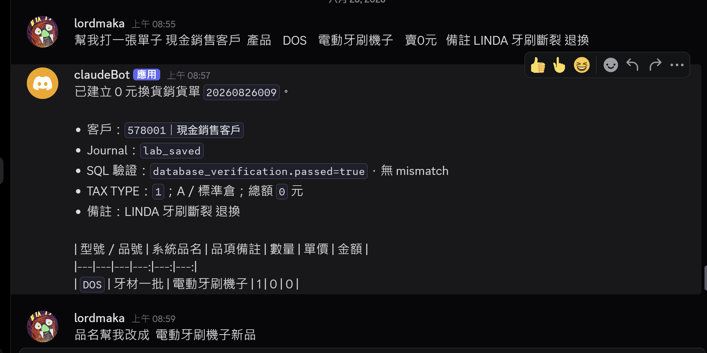</a>

AI 只負責理解「使用者想做什麼」；真正進 ERP 前，內容會被轉成固定 JSON 欄位、預覽並確認。打單仍由確定性的 CLI 與 ERP 商業規則完成，完成後再以 SQL 交叉核對。這讓 AI 有彈性，但不會取得直接寫資料庫的權力。

### 2. Web：把桌面入口拆成跨裝置工作流

<a href="docs/screenshots/sales-query-web.png">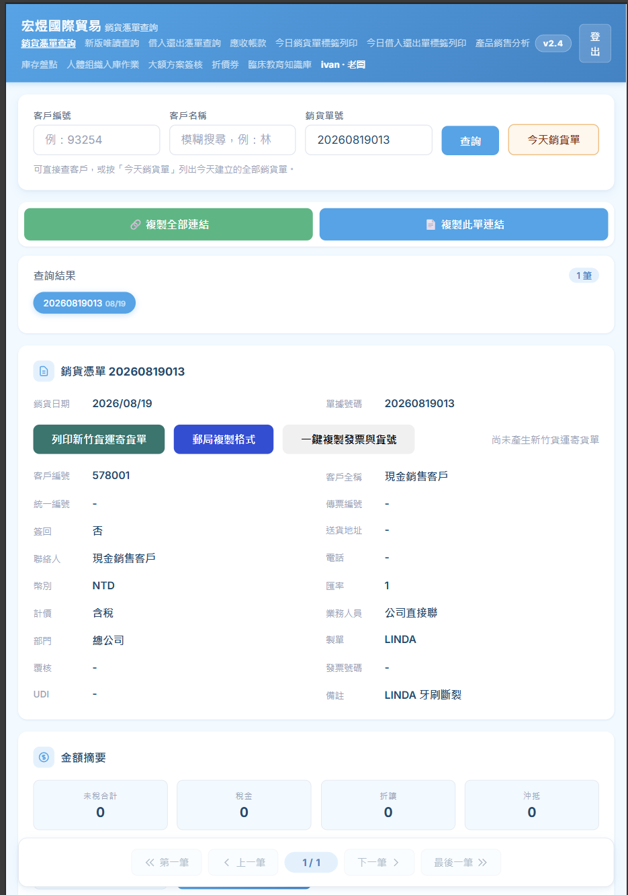</a>

同一個 Headless 核心也能支援遠端 Web 查詢、客戶模糊搜尋、歷史單據切換與作業整合。另一個已部署工作頁還串接郵局標籤、貨運、電子發票與 UDI 紀錄；外部服務只取得完成該次任務所需的最少資料。

  
<strong>展開：實際出貨與第三方作業頁</strong>

   
  <a href="docs/screenshots/today-labels-workflow.png">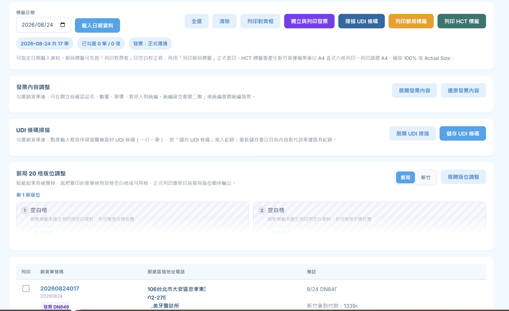</a>

### 3. 分析與預測：資料不只拿來顯示，還能支持下一個決策

上游的 `legacy-erp-headless-bridge` 負責安全、唯讀、可驗證地取得 ERP 資料；下游的 [customer-sales-intelligence](https://github.com/joeIvan2/customer-sales-intelligence) 則把資料轉成業務可用的補貨提醒、客戶分群、交叉推薦、購買預測與工作清單。兩個 Repository 刻意分工：橋接層不偷偷做模型，分析層也不能越權操作 ERP。

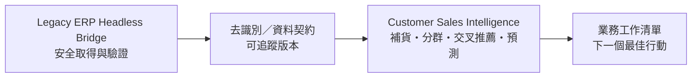

## 這個專案如何對應 AI 賦能應用工程師

| 職缺要解的問題 | 這個專案已經做過的事 |
| --- | --- |
| AI 工作流整合 | 把 AI、Discord、Web、CLI、SQL Server 與 Windows ERP 串成端到端流程 |
| 客製化解決方案 | 不要求企業先換掉老系統，而是從實際限制找到可漸進導入的安全邊界 |
| API 與後端開發 | 以 Python、Flask、固定 JSON contract 與受控 Adapter 提供多端共用能力 |
| 商務分析與流程再造 | 將人工看表單、打單、核對、出貨與分析拆成可驗證、可稽核的步驟 |
| 推論成本與可靠性 | AI 只放在自然語言理解；核心查詢、寫入、驗證維持確定性，不浪費 Token 重做 ERP 規則 |
| 技術導入與支援 | 保留舊系統正常營運，逐步從 GUI PoC 升級到 Headless，不做一次性大爆改 |

## 技術與工程邊界

- Python / Flask / typed JSON contracts
- Microsoft SQL Server read-only analysis
- Windows UI Automation / Accessibility Insights
- Delphi DFM 與互通性研究
- Windows native interoperability / ERP business objects
- Discord application integration
- HTML / CSS / JavaScript Web UI
- pytest contract and regression testing
- 唯一請求識別、確認、reconciliation 與 fail-closed 操作政策

這個公開 Repository 只呈現原創架構、方法、成果畫面與安全設計；不包含原版 EXE、原廠 Library、反編譯原始碼、帳密、連線字串、可直接操作正式 ERP 的程式碼或資料庫寫入腳本。圖片由專案所有者提供並明確指定公開，使用規則見 [Screenshot Policy](docs/screenshots/README.md)。

更多設計細節： [Architecture](docs/ARCHITECTURE.md) · [Milestones](docs/MILESTONES.md) · [File Map](docs/FILE_MAP.md) · [Security](SECURITY.md)

---

**真正的 AI 落地，不是把 Chatbot 放在舊流程旁邊；是先看懂舊流程、找到安全邊界，再讓 AI 能可靠地完成工作。**

---

# No API, No Documentation, No Downtime: Connecting a 26-Year-Old 32-bit Delphi ERP to AI

> This is not an ERP rewrite, remote desktop automation, or an AI system writing directly to a database. This project turns a Windows ERP from the early 2000s into a verifiable system boundary, then connects it to a headless CLI, a Discord natural-language workflow, web applications, and sales forecasting.

## The problem: an ERP that has no safe door

A legacy ERP contains customers, orders, inventory, accounting data, and years of accumulated business rules. However, this system has no modern **API** and no stable **CLI** that other software can call. The data exists, but external systems have no safe and verifiable way to reach it.

**The largest gap between AI and higher organizational productivity is often a legacy ERP with no API that can only be operated by people.**

Every new requirement therefore becomes a high-risk customization project:

- E-invoicing: how can the correct products, tax types, and amounts be retrieved while preserving an auditable processing record?
- Third-party payments: how can payments be created, webhooks received, and transactions safely reconciled with ERP documents?
- Third-party logistics: how can the minimum required data be submitted, labels and shipment status retrieved, without exposing ERP credentials?
- Remote order entry: how can sales staff create orders from a phone, macOS, or Discord without remotely controlling an office Windows PC?
- Sales forecasting: how can transaction history become replenishment, repurchase, and cross-sell signals instead of another manual Excel export?
- Lead tracking and prediction: how can customer interactions, next actions, and outcomes be written back into a continuously improving loop?

This project adds that missing door without breaking the existing ERP. Internal capabilities are exposed as a **headless CLI with a JSON contract**, allowing invoicing, payments, logistics, remote order entry, and AI analysis to share the same verifiable core.

[Open the 16-slide bilingual fullscreen pitch](https://joeivan2.github.io/legacy-erp-headless-bridge/) · [View the GitHub repository](https://github.com/joeIvan2/legacy-erp-headless-bridge)

### These are operating capabilities, not a roadmap

The image above shows modules already operating in one workflow: sales and loan/return queries, accounts receivable, invoice and logistics labels, product sales analysis, inventory counting, human-tissue receiving, high-value plan approvals, coupons, and a clinical education knowledge base. Third-party payment and receivable reconciliation are also completed capabilities. Future work may add adapters for new payment or logistics providers; it does not start the ERP integration again from zero.

This showcase is my most direct practical response to Phison Electronics' [AI-Enabled Application Engineer](https://www.104.com.tw/job/8y9sm?jobsource=company_job) role. When an enterprise system has no complete manual, I use experimentation, decomposition, verification, and iterative improvement to connect AI to the real workflow—not to build a demo that stops working outside a controlled environment. It also reflects Phison's idea of a [gamer's problem-solving mindset](https://uanalyze.com.tw/articles/2374653827): learn the rules, break through constraints, and turn the solution into a system that other people can use reliably.

## Starting point: an old ERP that still runs the business

The original system is a 32-bit Delphi Windows executable. It carries years of business rules, but it has no modern API and cannot run directly on macOS, mobile devices, or ordinary cloud environments. The goal was not to replace everything at once. The first objective was to find a safe, reconcilable path that could support gradual replacement.

## Core solution: choose a reliable path out of the ERP

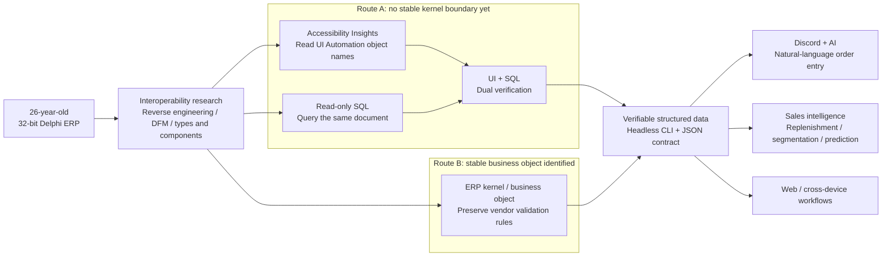

Interoperability research on legally owned and deployed software—using reverse engineering, DFM analysis, and type relationships—was used to identify the responsibility boundaries between screens, data, and business rules, not to copy the vendor's program. Each module then follows one of two routes according to its maturity; both routes do not need to be repeated for every operation.

- **Route A | Accessibility plus SQL dual verification:** before the internal object boundary is known, [Accessibility Insights for Windows](https://accessibilityinsights.io/) Live Inspect reads UI Automation object names and a read-only SQL query retrieves the same document. A field relationship is accepted only when both sides agree. Microsoft currently recommends Accessibility Insights for accessibility inspection, while the traditional Inspect tool can still provide detailed UIA properties and control patterns. [Official documentation](https://learn.microsoft.com/windows/apps/design/accessibility/accessibility-testing)
- **Route B | Call the ERP kernel directly:** once a stable business object is identified through reverse engineering, types, and component relationships, coordinate-based mouse and keyboard automation can be removed. The original ERP rules execute the operation, and a read-only query independently reconciles the result.

### Route A: cross-check the same document through UI objects and MSSQL

<table>
  <thead>
    <tr>
      <th width="50%">Understand UI structure and objects</th>
      <th width="50%">Verify persisted data with read-only SQL</th>
    </tr>
  </thead>
  <tbody>
    <tr>
      <td></td>
      <td></td>
    </tr>
    <tr>
      <td>First identify field names, control hierarchy, and form semantics. The rebuilt screen is used for field-by-field comparison, not screenshot streaming.</td>
      <td>Then follow the document number to the customer, products, quantities, and prices to prove that the UI and query refer to the same persisted record.</td>
    </tr>
  </tbody>
</table>

### Route B: remove UI events and connect directly to ERP business objects

This web screen is not RDP, VNC, a canvas screenshot, or a WebView wrapper. The backend retrieves data through the existing ERP boundary, and the frontend rebuilds the information hierarchy with native HTML, CSS, and JavaScript. The bottom of the screen reports `SQL read-only`, `UI untouched`, and `0 ERP keyboard events`, showing that production queries no longer depend on a foreground window.

## Why not INSERT or UPDATE the database directly?

ELI5 version: a sales voucher is not a sticky note. It is a multi-part document that can affect accounting, inventory, tax, invoices, batch numbers, and audit records at the same time.

A direct SQL write can make the screen look correct while silently missing related tables, state fields, or vendor business rules. The damage may not appear immediately. It can accumulate as inventory imbalances, inconsistent tax amounts, failed reconciliation, or duplicate documents. This project therefore follows fixed rules:

- SQL is used only for exploration, read-only queries, and post-operation reconciliation.
- Production document creation and modification always go through the ERP kernel or an existing business object.
- Every write operation uses a fixed schema, explicit confirmation, a unique request identifier, and independent reconciliation after completion.
- If the result is uncertain, stop. Do not retry blindly.

## Once data is available: one core, multiple entry points

### 1. Discord plus AI: turn natural language into a verifiable sales voucher

AI is responsible only for understanding the user's intent. Before anything reaches the ERP, the request becomes fixed JSON fields, is previewed, and requires confirmation. A deterministic CLI and the ERP's business rules create the document. A separate SQL query then reconciles the result. AI provides language flexibility without gaining permission to write directly to the database.

### 2. Web: turn a desktop entry point into a cross-device workflow

The same headless core supports remote web queries, fuzzy customer search, historical document switching, and integrated operations. Another deployed work page connects postal labels, logistics, e-invoicing, and UDI records. Each external service receives only the minimum data needed for the current task.

  
<strong>Expand: operating shipment and third-party service page</strong>

   
  

### 3. Analytics and prediction: data should support the next decision, not only display the past

The upstream `legacy-erp-headless-bridge` retrieves ERP data safely, read-only, and with verification. The downstream [customer-sales-intelligence](https://github.com/joeIvan2/customer-sales-intelligence) turns that data into replenishment reminders, customer segments, cross-sell recommendations, purchase predictions, and sales worklists. The repositories intentionally have separate responsibilities: the bridge does not hide modeling logic, and the intelligence layer cannot operate the ERP beyond its authority.

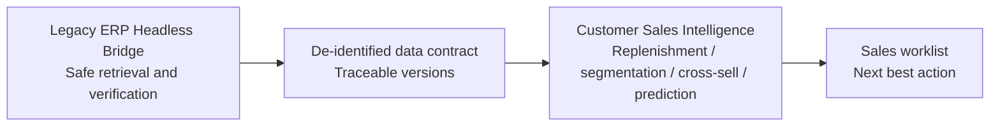

## How this project maps to an AI-Enabled Application Engineer role

| Problem the role needs to solve | What this project has already demonstrated |
| --- | --- |
| AI workflow integration | Connected AI, Discord, web, CLI, SQL Server, and a Windows ERP into an end-to-end workflow |
| Customized solutions | Found a safe, gradual integration boundary under real constraints instead of requiring the company to replace its legacy system first |
| API and backend development | Used Python, Flask, typed JSON contracts, and controlled adapters to provide shared capabilities to multiple clients |
| Business analysis and process redesign | Turned form reading, order entry, reconciliation, shipping, and analytics into verifiable and auditable steps |
| Inference cost and reliability | Kept AI at the natural-language boundary while deterministic queries, writes, and verification handle ERP rules without wasting tokens recreating them |
| Technical implementation and support | Kept the legacy system running while gradually moving from a GUI proof of concept to a headless architecture |

## Technology and engineering boundaries

- Python / Flask / typed JSON contracts
- Microsoft SQL Server read-only analysis
- Windows UI Automation / Accessibility Insights
- Delphi DFM and interoperability research
- Windows native interoperability / ERP business objects
- Discord application integration
- HTML / CSS / JavaScript web UI
- pytest contract and regression testing
- Unique request identifiers, confirmation, reconciliation, and fail-closed operation policies

This public repository contains only original architecture, methods, result screenshots, and safety design. It does not contain the original executable, vendor libraries, decompiled source code, credentials, connection strings, production ERP automation code, or database write scripts. The screenshots were provided by the project owner and explicitly approved for public use; see the [Screenshot Policy](docs/screenshots/README.md).

More design details: [Architecture](docs/ARCHITECTURE.md) · [Milestones](docs/MILESTONES.md) · [File Map](docs/FILE_MAP.md) · [Security](SECURITY.md)

---

**Real enterprise AI adoption is not a chatbot placed beside an old workflow. It begins by understanding the workflow, identifying a safe boundary, and then enabling AI to complete real work reliably.**
