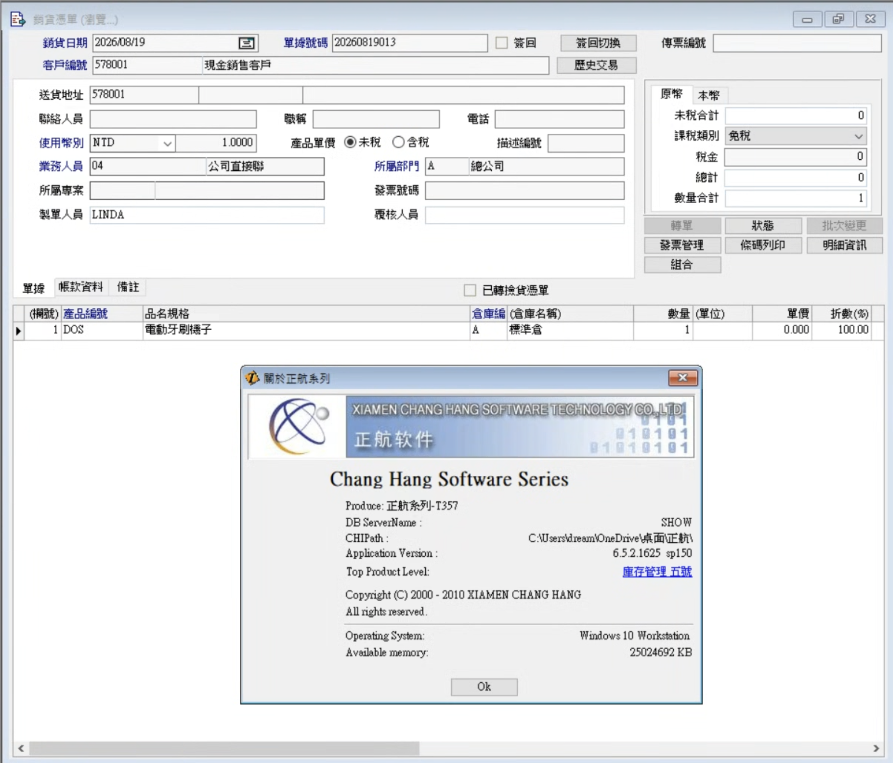
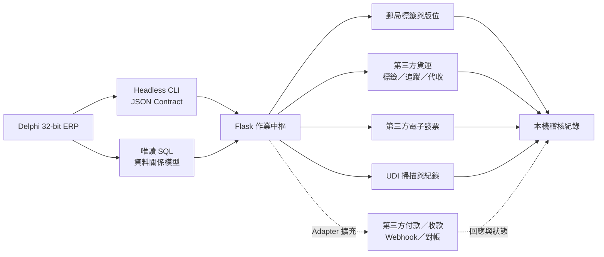
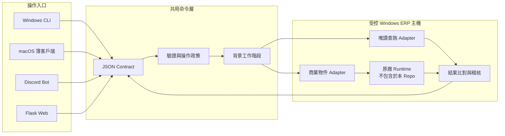
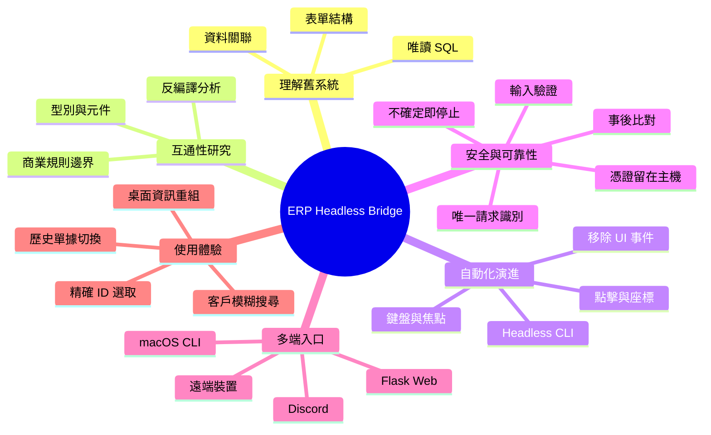

# Legacy ERP Headless Bridge

> 將只能在 Windows 桌面操作的傳統 ERP，逐步拆成可驗證的 Headless CLI、Discord 工作流與遠端 Web 介面；保留原有商業規則，同時讓帳密、原廠執行元件與企業資料留在受控主機。

## 原版 EXE × 真實 Web 對照

<table>
  <thead>
    <tr>
      <th width="50%">Delphi 32-bit Windows EXE</th>
      <th width="50%">Flask 真實網頁版本</th>
    </tr>
  </thead>
  <tbody>
    <tr>
      <td><a href="docs/screenshots/original-erp.png"></a></td>
      <td><a href="docs/screenshots/web-sale-voucher.png"></a></td>
    </tr>
    <tr>
      <td>原版只能在相容 Windows 桌面環境執行；圖中同時保留版本對話框作為舊技術棧背景。</td>
      <td>這是可互動的 Flask／HTML／CSS／JavaScript 頁面，不是遠端桌面或畫面串流。</td>
    </tr>
  </tbody>
</table>

兩張圖使用同一張示範銷貨單，保留相同欄位內容，讓桌面版與 Web 版可以直接比對。Web 版的表單位置與層級來自反編譯後的 DFM 結構研究，而資料是後端當次讀取後填入；畫面不預抓下一張單。

兩張圖片使用「現金銷售客戶」示範資料，沒有個人客戶資訊，並依原始像素公開展示；圖片使用原則見 [docs/screenshots/README.md](docs/screenshots/README.md)。

這是一個以正航 IT357 網路版為研究對象的工程 Showcase。Repository 只呈現我處理舊系統整合時的思考、架構與里程碑，不包含原版 EXE、原廠 Library、反編譯產物、可用帳號密碼、資料匯出或可直接複製專有流程的實作細節。

## 為什麼不公開操作程式碼

基於商業軟體版權疑慮、原廠授權邊界與企業環境安全考量，這個 Repository 不放上反編譯原始碼、完整實作原始碼，也不提供可直接驅動原廠元件的對應操作程式碼。公開內容限於我原創的系統架構、研究方法、里程碑、介面成果與安全設計，用來說明如何解決問題，而不是散布第三方程式或可直接複製的專有整合方式。

## 我為什麼做這個專案

傳統 ERP 的價值通常累積在多年驗證過的商業規則裡，但操作入口仍被固定在單一 Windows 桌面與人工表單流程。我的目標不是重寫整套 ERP，而是找出穩定邊界，讓既有能力可以被 CLI、Bot 與 Web 安全地重用。

這個過程從資料理解開始，經過桌面自動化的過渡階段，最後把銷貨單查詢與建立整理成一致的 JSON 契約。相同核心可以接到不同入口，而不需要每一種介面各自重做 ERP 規則。

## 原系統的限制

目前部署的原版是以 Delphi 建置的 32-bit Windows 桌面 EXE，並依賴同一套 32-bit Windows Runtime。使用中的版本已長期停留在原有技術棧，沒有再取得適用的原廠更新，因此功能雖然穩定，操作範圍卻被綁在舊式 Windows 桌面。

- macOS、iOS、Android 與一般非 Windows 環境不能原生執行這套 EXE／Library。
- 相容的 x86 Windows 虛擬機理論上可以執行，但仍等於維護完整 Windows 桌面、授權與遠端操作環境，沒有解決手機與跨平台入口問題。
- 手機或一般終端裝置無法直接載入原程式，也無法合理重現它的桌面視窗與 32-bit 相依元件。
- 因此我保留受控 Windows ERP 主機作為唯一執行節點，再把安全、結構化的能力提供給其他裝置。

## 這是真的 Web，不是遠端桌面

Web 版由 Flask API 與瀏覽器原生 HTML／CSS／JavaScript 組成。畫面中的表單、欄位與表格都是瀏覽器實際渲染並可互動的 DOM，不是 ERP 截圖、RDP／VNC 串流、Canvas 影像，也不是把原版 EXE 包在 WebView 裡。

為了讓業務在公司外用手機或終端瀏覽器操作，我先透過反編譯與 DFM 表單資源分析位置、尺寸、父子層級與欄位語意，再重建相同的資訊架構。第一個 Web milestone 刻意讓同一張銷貨單在兩邊呈現相同內容，方便逐欄比對資料正確性；真正的資料仍由後端即時查詢取得。

## 目前做到的內容

- 背景工作階段啟動：ERP 憑證只存在 Windows ERP 主機的使用者範圍，CLI、Discord、Web 與 macOS 端都不接收密碼。
- 銷貨單查詢：可依單號讀取，也可先模糊搜尋客戶名稱、確認正確客戶 ID，再切換該客戶的歷史單據。
- 銷貨單建立：透過既有商業物件執行，保留原系統驗證；不直接用 SQL 寫入正式單據。
- Headless 操作：正式 CLI 路徑不依賴螢幕座標、滑鼠點擊、焦點切換或鍵盤事件。
- 共用 JSON 契約：Windows CLI、macOS 薄客戶端、Discord Bot 與 Flask Web 使用同一個命令邊界。
- Web 版銷貨單：依桌面版表單結構重建可閱讀介面，保留框架並只替換當次即時讀取的資料。
- 可驗證結果：高風險操作採用確認、唯一請求識別與事後比對，遇到不確定結果時停止重送。

## 從 ERP CLI 到第三方作業中樞

Headless CLI 的價值不只是不開啟 ERP 視窗。透過互通性所需的反編譯與唯讀 SQL 交叉研究，我釐清既有商業物件，以及銷貨單、客戶、品項、地址與金額之間的資料關係，再把這些能力整理成穩定的 JSON 契約。後續功能因此可以組合既有 ERP 資料與外部服務，而不必再從桌面畫面抓字、模擬點擊，或為每個新入口重寫一次規則。

[實際部署的標籤與出貨工作頁](https://sale.hon.dental/today-labels)（需授權登入）就是其中一個延伸。這是由 Flask 與瀏覽器原生技術建立的真實 Web 應用，不是 ERP 畫面串流：它能依日期載入銷貨單、選取待處理單據，再串起郵局版位、貨運標籤、電子發票與 UDI 紀錄等作業。

<a href="docs/screenshots/today-labels-workflow.png"></a>

> 上圖是實際瀏覽器頁面的去識別化截圖，不是設計稿；依日期載入、發票內容調整、UDI 掃描、郵局版位與 HCT 標籤等控制項皆屬真實 Web 功能。圖片已由資料提供者確認可公開。

目前已實作與可接續擴充的範圍刻意分開標示：

| 狀態 | 能力 |
| --- | --- |
| 已實作 | 依日期讀取 ERP 銷貨資料、勾選與批次處理、郵局 20 格標籤版位、UDI 條碼掃描與紀錄 |
| 已實作 | 串接第三方貨運建立託運資料、產生標籤、查詢貨態，並支援貨運代收貨款資料 |
| 已實作 | 依銷貨單內容整理品項與金額，串接第三方電子發票服務，保存可稽核的處理結果 |
| 可擴充 | 以相同 Adapter 邊界接入付款連結、信用卡／虛擬帳號、第三方收款狀態、Webhook 與自動對帳；這些是架構可承接的下一步，不宣稱所有金流服務目前都已上線 |



外部服務只接收完成該次作業所需的最少資料；ERP 帳密、資料庫連線與原廠元件仍留在受控 Windows 主機。SQL 僅用於唯讀理解、查詢與核對，正式 ERP 寫入仍經既有商業物件；第三方回應則獨立保存狀態與稽核識別，方便追蹤與對帳。

## Milestones

| 階段 | 重點 | 結果 |
| --- | --- | --- |
| 1. Read-only SQL discovery | 先找出最原始、可稽核的持久化資料與關聯 | 能獨立核對單號、客戶、品項與金額 |
| 2. Interoperability research | 對合法持有的程式進行反編譯、型別與元件結構分析 | 找出能沿用既有商業規則的穩定邊界 |
| 3. GUI automation bridge | 先以點擊、鍵盤與滑鼠完成端到端概念驗證 | 證明流程可自動化，也看見焦點與座標的脆弱性 |
| 4. UI-event removal | 逐步以程式介面取代人工輸入事件 | 不再依賴畫面位置與輸入焦點 |
| 5. Headless CLI | 將登入、查詢、建立與驗證封裝為結構化命令 | 腳本與其他服務可以穩定呼叫 |
| 6. Connected workflows | CLI 接上 Discord、遠端 macOS 與 API | 可從不同裝置送出結構化工作 |
| 7. Flask Web UI | 將桌面表單資訊重新組成瀏覽器介面 | 遠端查詢、快速切單並保留原有資訊層次 |

完整演進記錄見 [docs/MILESTONES.md](docs/MILESTONES.md)。

## 系統架構



讀取與寫入刻意分開：SQL 只負責探索、唯讀查詢與結果核對；建立銷貨單仍走原系統商業物件，以保留既有規則。

更多信任邊界與登入／銷貨單流程見 [docs/ARCHITECTURE.md](docs/ARCHITECTURE.md)。

## 心智圖



## CLI 體驗

以下是刻意簡化的概念介面，不是可直接執行的內部命令：

```text
erpctl session status
erpctl voucher query  --bill <BILL_NO>
erpctl voucher create --input <ORDER_JSON> --confirm <TOKEN>
```

呼叫端只取得精簡、可機器判讀的結果：

```json
{
  "ok": true,
  "operation": "voucher.query",
  "fresh_read": true,
  "ui_touched": false
}
```

實際 ERP 帳密、資料庫連線、內部工具名稱與商業物件參數都不會出現在命令列、回應或這個 Repository。

## 我在意的工程問題

| 問題 | 這個專案的處理方式 |
| --- | --- |
| 桌面 UI 綁定座標、焦點與人工節奏 | 先用 GUI automation 驗證，再逐步改成程式邊界與 Headless CLI |
| SQL 資料不等於 ERP 商業規則 | SQL 僅唯讀；正式建立透過既有商業物件，完成後再獨立核對 |
| 網路逾時後重送可能產生重複單據 | 使用唯一請求識別、持久化狀態與 reconciliation；結果不明時禁止盲目重試 |
| CLI 或 Bot 容易洩漏帳密 | 憑證只由 Windows 主機本機工作階段讀取，不進參數、JSON、Log 或版本控制 |
| 原始 Library 無法直接在 macOS 執行 | 將 Windows 保留為執行節點，macOS 只承擔 SSH／JSON 薄客戶端角色 |
| 網頁切單既要快又不能看見舊資料 | 不預抓單據；每次操作重新查詢，前端保留框架並原子替換資料 |

## 技術組成

- Python / argparse / typed JSON contracts
- Flask / HTML / CSS / JavaScript
- Microsoft SQL Server read-only analysis
- Windows native interoperability / PowerShell
- OpenSSH remote transport
- Discord application integration
- pytest contract and regression testing
- Mermaid architecture documentation

## Repository 內容

- [docs/ARCHITECTURE.md](docs/ARCHITECTURE.md)：架構、信任邊界與高階流程
- [docs/MILESTONES.md](docs/MILESTONES.md)：從 SQL discovery 到 Headless CLI／Web 的演進
- [docs/FILE_MAP.md](docs/FILE_MAP.md)：實作檔案職責索引，不包含程式內容
- [docs/screenshots/README.md](docs/screenshots/README.md)：原版與 Web 版截圖的去識別化規則
- [SECURITY.md](SECURITY.md)：憑證、企業資料與專有元件的保護方式

## 不包含的內容

- 原版 EXE、DLL、BPL 或其他原廠 Binary
- 完整實作原始碼、反編譯原始碼、記憶體 Dump、型別庫 Dump 或函式位址
- 可直接驅動原廠元件、登入或操作正式 ERP 的對應程式碼
- 資料表清單、連線字串與可重現內部資料模型的細節
- ERP、Discord、SSH 或資料庫帳號密碼與 Token
- 可識別的正式客戶、產品、單據、企業資料或批次匯出
- 可直接對正式環境執行的腳本或設定檔

## 專案邊界

這是獨立的互通性研究與原創整合文件，並非原廠產品、外掛或授權替代品。正航、IT357 及相關名稱與介面之權利歸原權利人所有，本專案與原廠無隸屬或背書關係。

我喜歡把「只能由人在特定電腦上完成」的工作，拆成可理解、可驗證、可組合的系統邊界；這個專案記錄的正是從舊式桌面流程走到安全遠端操作的完整路徑。
