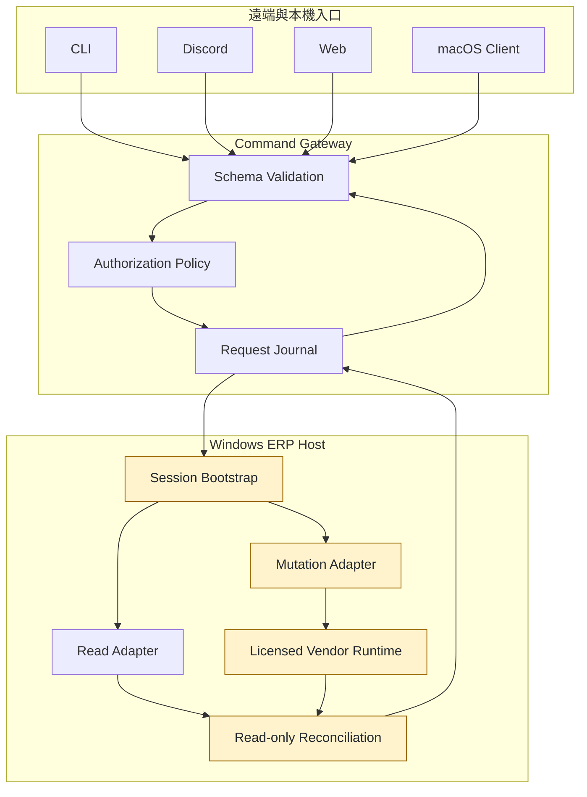
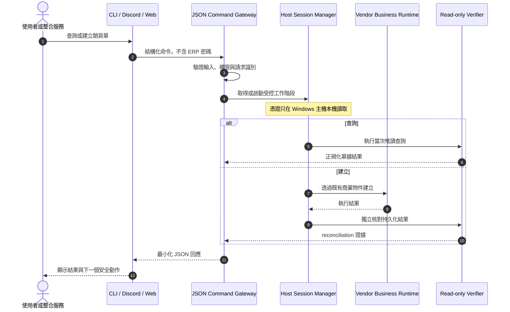
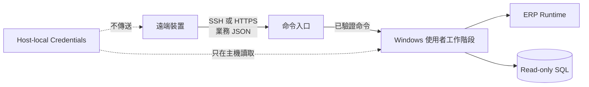

# Architecture

本文件只描述高階設計，不公開原廠元件名稱、載入方式、內部函式、資料表或部署識別資訊。

## 設計原則

1. 保留既有商業規則：正式建立單據不以 SQL 模擬。
2. 讀寫分離：SQL 僅用於唯讀探索、查詢與結果驗證。
3. 憑證不離開主機：遠端入口只傳輸業務命令，不傳 ERP 密碼。
4. 一個核心、多個入口：CLI、Discord 與 Web 共用相同 JSON contract。
5. Fail closed：操作結果不確定時停止，不以重送猜測結果。
6. 可稽核：命令、預覽、確認與結果各有可追蹤狀態，但 Log 不含秘密。

## 邏輯架構

`Licensed Vendor Runtime` 是部署環境既有的合法安裝相依項，不包含於這個 Showcase。

## 背景登入與銷貨單流程

## 安全邊界

- 遠端客戶端沒有 ERP 密碼，也不能要求系統回傳密碼。
- 帳密不放在命令列、SSH 參數、JSON payload、Log 或 Repository。
- CLI 只接受固定命令與 schema 驗證後的欄位。
- 單據建立需要明確確認；不確定結果只能 reconciliation，不能重做 mutation。
- Web 查詢預設不快取單據，避免顯示過期內容。

## 平台策略

原版是 Delphi 建置的 32-bit Windows EXE，原廠 Runtime 也維持 32-bit Windows 相依，因此 Windows 是唯一 ERP 執行節點。Python 適合先整合既有驗證、稽核與 native bridge；macOS 使用薄 CLI 透過 SSH／JSON 呼叫。未來若需要單一執行檔，可用 Rust 重寫薄客戶端，但不會假裝能在 macOS 原生載入 Windows 原廠 Library。

相容的 x86 Windows VM 可能執行原版程式，但它仍需要完整 Windows 桌面、授權與互動工作階段，並不能成為手機或一般終端的直接入口。Web 版則是真正的 Flask／HTML／CSS／JavaScript 應用：瀏覽器接收結構化資料並渲染 DOM，不傳送原 ERP 畫面的像素串流。
